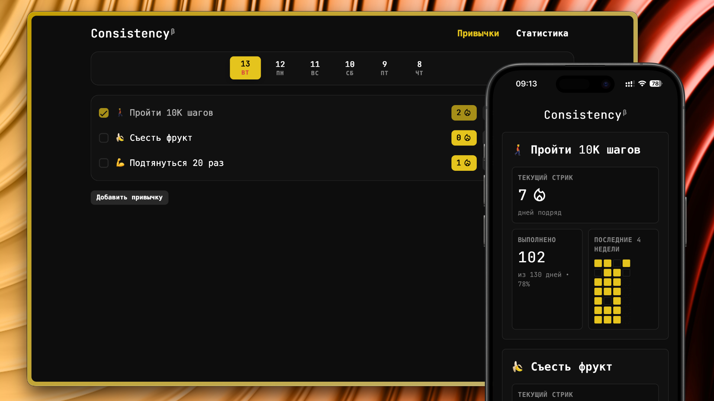

# Consistency

Минималистичное веб-приложение для отслеживания привычек. Хранит данные в
`localStorage` браузера и работает как статический сайт, собранный через Parcel.

Написано с любовью и OpenAI Codex.



## Возможности

- Добавление, редактирование и удаление привычек
- Ежедневные отметки выполнения
- Переключение по дням
- Информативная статистика по соблюдению привычек

## Быстрый старт

```bash
npm install
npm run dev
```

Откройте адрес, который покажет Parcel (обычно `http://localhost:1234`).

## Структура проекта

- `public/index.html` — точка входа Parcel
- `src/scripts/` — JS-модули приложения
- `src/styles/` — SCSS-стили
- `src/icons/` — иконки и манифест
- `dist/` — результат сборки (не редактируется вручную)
